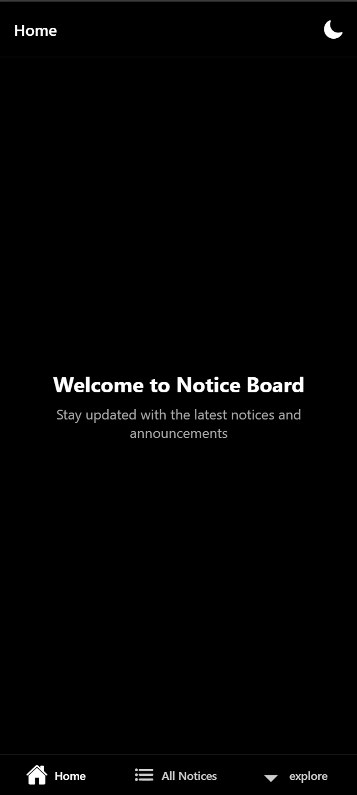
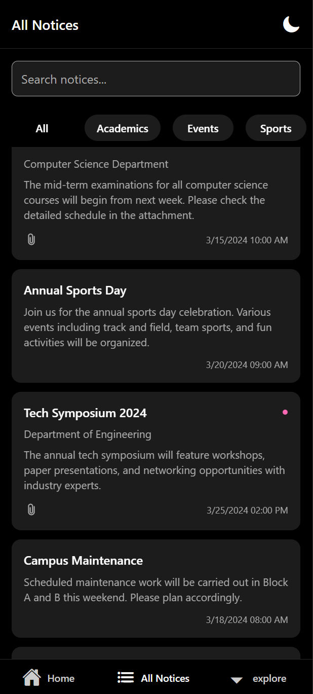
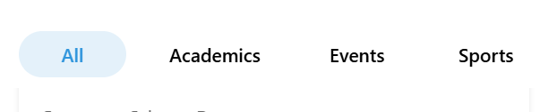
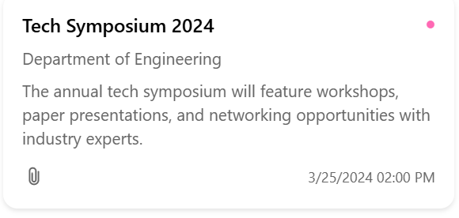
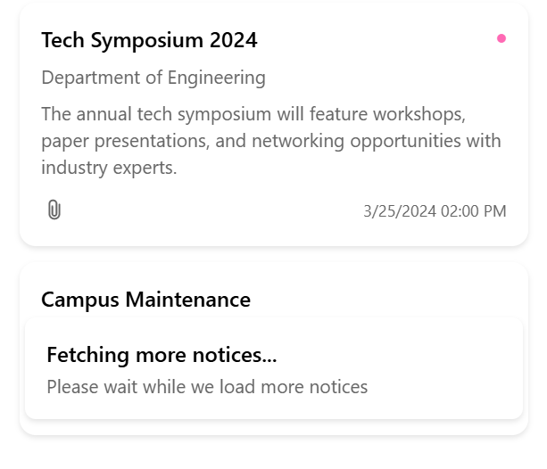
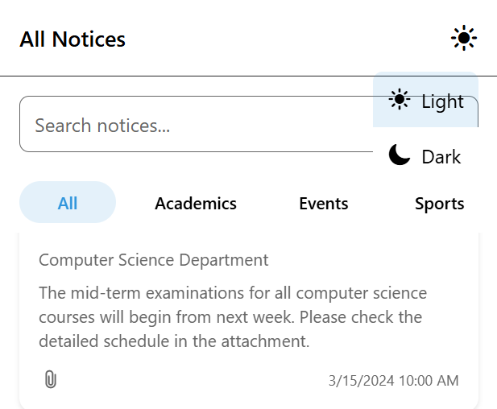
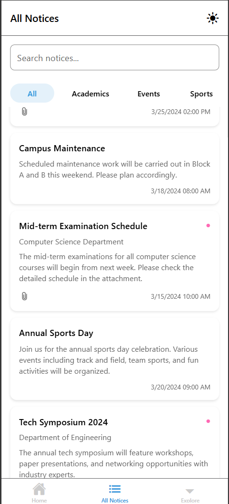

# Launchpad - Notice Board Mobile App

### Home Screen

### Notices Screen

### 1. Notice Listing Screen
- **Category-Specific View**: Displays notices filtered by selected category

- **Search Bar**: Dynamically filters notices by keywords

- **Notice Card Layout**:
  - Title, subtitle, and truncated description (3 lines max)
  - Date/time (bottom-right) and attachment indicator (bottom-left)
  - Unread indicator (pink icon)

- **Infinite Scroll**: Shows "Fetching more notices…" toast when reaching the end

### 2. Theme Support
- Light and dark mode toggle
- Consistent styling across all screens

